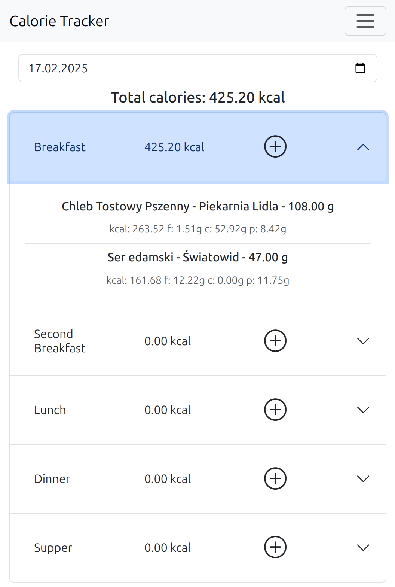

# Calorie Tracker
Test it [here](https://calorie-tracker.webredirect.org)

<picture>
    
</picture>

## Overview:
This web application enables users to monitor their caloric intake by logging their daily meals. The main feature of the app is a database that users can update with their favorite food products. For each product, the database stores essential nutritional values per 100 grams, including calories, fats, carbohydrates, and proteins. Users can add their products and search for them using a responsive search function or by scanning product barcodes.

## Tech stack
Django
Django Rest Framework
SQLite
bootstrap
nginx
uWsgi

## How to Run the Application locally
Make sure you have Python 3, PIP, and the Python venv installed on your system. For Debian-based systems, you can ensure you have everything you need by entering the following command:
```
sudo apt install python3 python3-venv python3-pip 
``` 
Once you have cloned or downloaded the source code, navigate to the root folder of the calorie-tracker and run the following commands: 
```
bash python3 -m venv .
source bin/activate
pip install -r requirements.txt
python3 manage.py migrate
python3 manage.pt collectstatic
python3 manage.py runserver 
``` 
If you are using a different operating system, you will need to figure out how to install the modules specified in the `requirements.txt` file. Make sure to run the command `python3 manage.py migrate` before executing `python3 manage.py runserver`.

